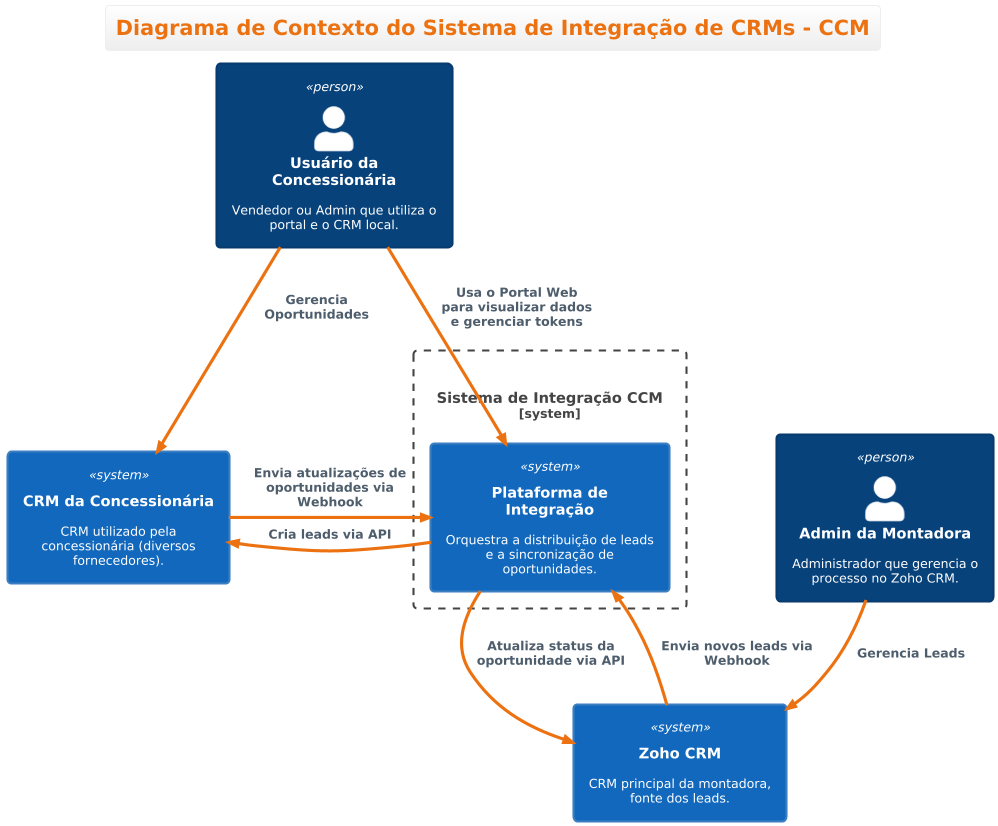
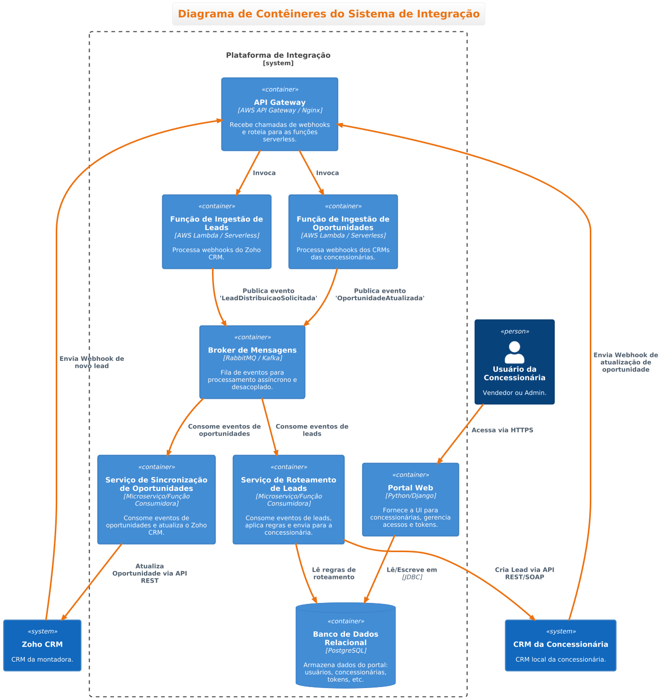
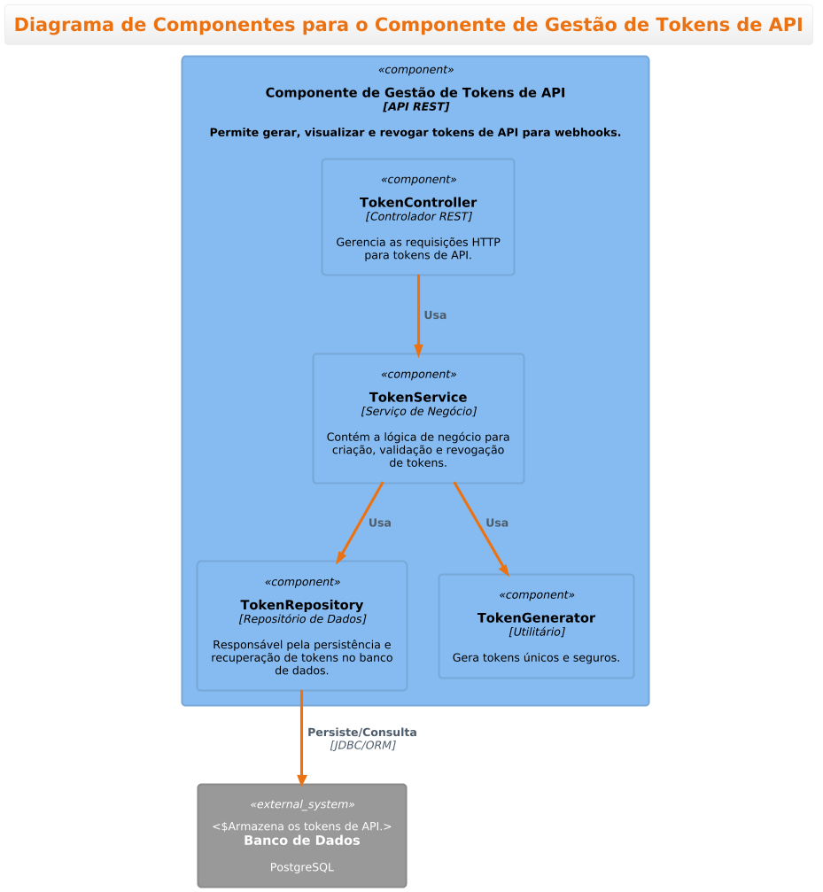
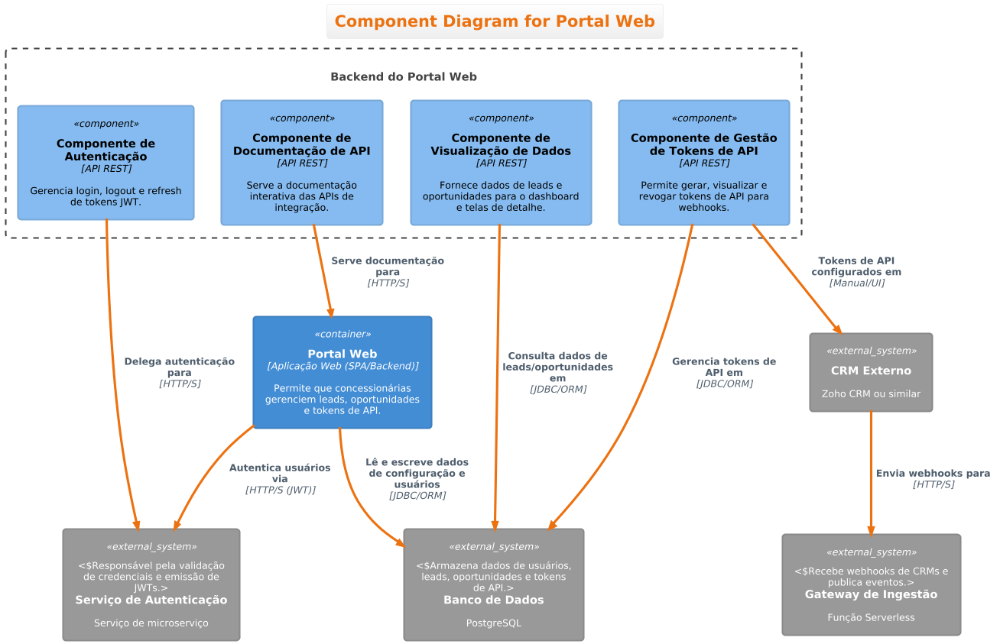
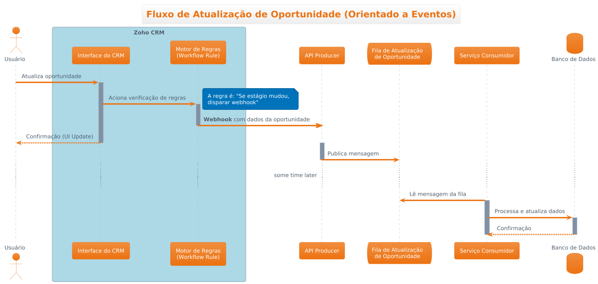
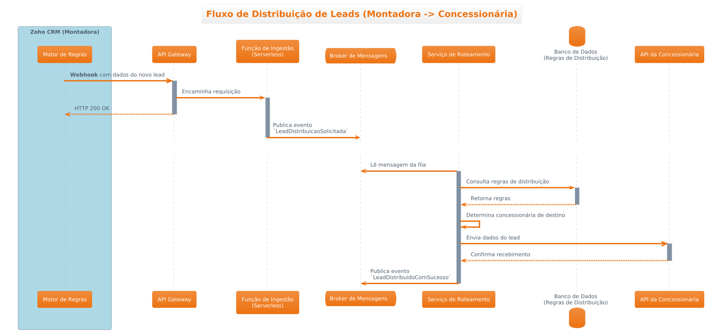
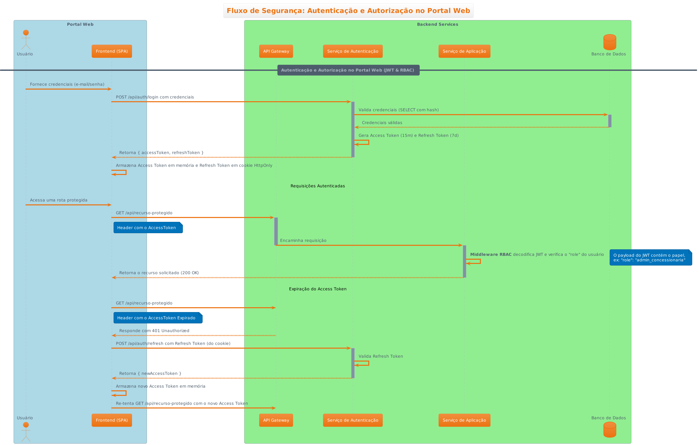
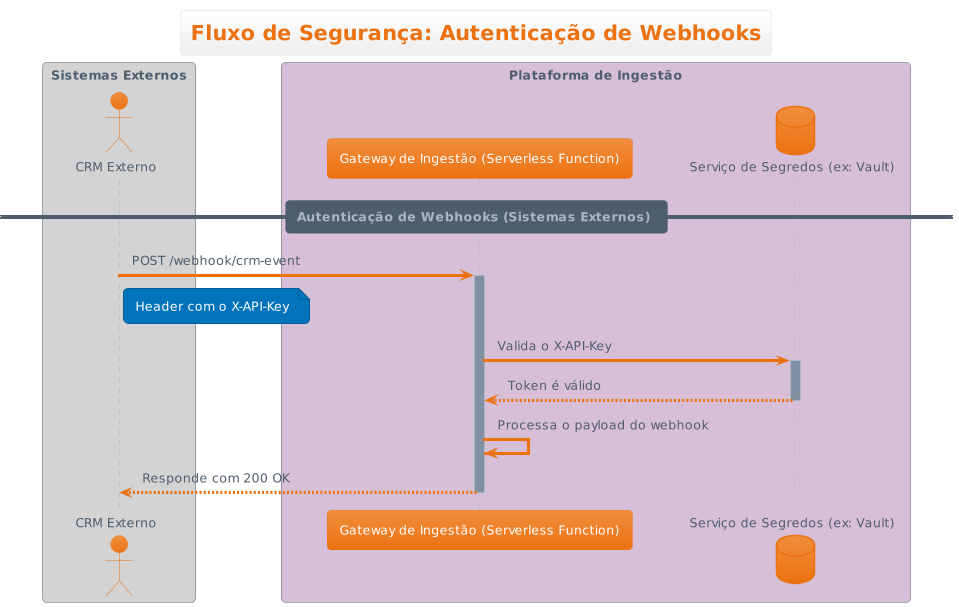

# Projeto de Prova de Conceito (POC) de Arquitetura de Sistema e Solução

---

**Data de Início:** 22 de julho de 2025, 18:17h

**Autor:** Edson Lourenço Bezerra Filho

Este projeto foi desenvolvido como uma **Prova de Conceito (POC)** para demonstrar minhas habilidades na concepção de  **arquiteturas de sistema e solução** . Ele foi cuidadosamente  **baseado e orientado pelo Modelo C4 e por Diagramas de Sequência** , com todas as representações visuais criadas utilizando  **PlantUML** . Para agilizar e padronizar o processo, utilizei a biblioteca **C4-PlantUML** como referência e base de apoio, disponível em: [https://github.com/plantuml-stdlib/C4-PlantUML/blob/master/README.md](https://github.com/plantuml-stdlib/C4-PlantUML/blob/master/README.md).

---

## Documentação de Arquitetura

Este projeto inclui uma  **documentação de arquitetura detalhada** , organizada para facilitar a compreensão e futura manutenção. Você encontrará os seguintes artefatos principais:

### Registros de Decisão de Arquitetura (ADRs)

* [ADR-001: Escolha da Arquitetura Híbrida (Microserviços + Orientada a Eventos/Serverless)](./adrs/arquitetura-geral.md)

### Diagramas C4 Model

#### Diagramas de Contexto

* [Diagrama de Contexto do Sistema de Integração de CRMs - CCM (PUML)](./diagramas/c4_model/c4-contexto.puml)
* 

#### Diagramas de Contêineres

* [Diagrama de Contêineres do Sistema de Integração (PUML)](./diagramas/c4_model/c4-container.puml)
* 

#### Diagramas de Componentes

* [Componente de Gestão de Tokens de API (PUML)](./diagramas/c4_model/c4-componete-gestao-tokens.puml)
* 
* [Componente do Portal Web (PUML)](./diagramas/c4_model/c4-componente-portal-web.puml)
* 

### Diagramas de Sequência

* [Fluxo de Atualização de Oportunidade (PUML)](./diagramas/sequencial/fluxo-atualizacao-oportunidade.puml)
* 
* [Fluxo de Distribuição de Leads (PUML)](./diagramas/sequencial/fluxo-distribuicao-leads.puml)
* 
* [Fluxo de Segurança: Autenticação e Autorização no Portal Web (PUML)](./diagramas/sequencial/fluxo-seguranca-portal-web.puml)
* 
* [Fluxo de Segurança: Autenticação de Webhooks (PUML)](./diagramas/sequencial/fluxo-seguranca-webhooks.puml)
* 
